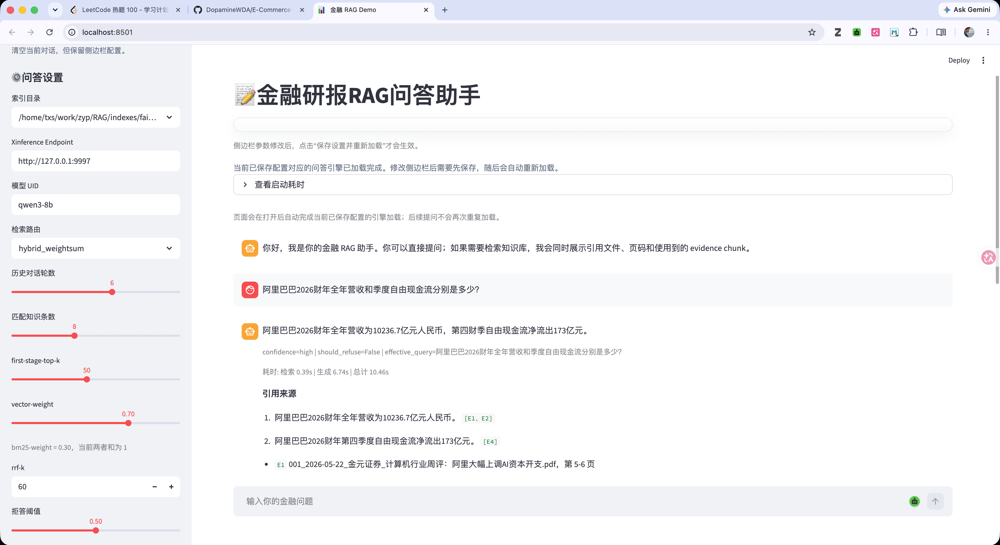
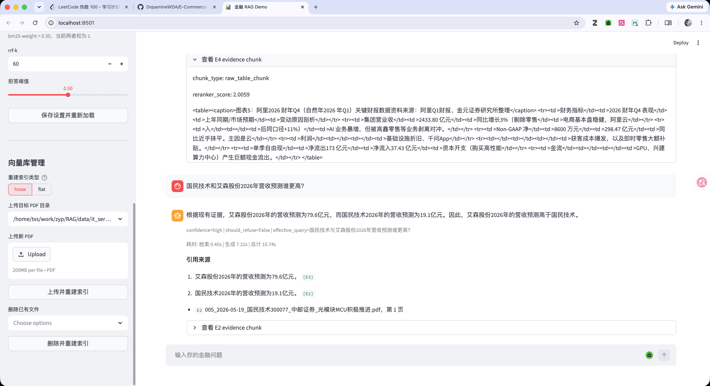
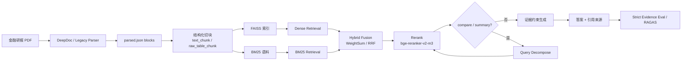

# 中文金融研报 RAG 项目

这是一个面向中文金融研报问答场景的 RAG 项目。项目重点不是只做一个“能回答问题”的 Demo，而是尽量把金融 RAG 中最难、最容易失真的几个环节做成一条可复现、可评测、可持续优化的工程链路：

`PDF 解析 -> 结构化分块 -> 向量 / BM25 / 混合检索 -> 二阶段重排 -> Query Rewrite / Query Decompose -> 证据约束生成 -> 严格评测`

## Demo 展示

项目提供了一个可直接运行的 Streamlit 可视化问答界面，适合在 GitHub 首页快速展示完整问答链路，包括：

- 左侧参数面板：索引、模型、检索路由、历史轮数、召回条数、融合权重、拒答阈值
- 中间对话区域：用户问题、模型回答、置信度、耗时、effective query
- 证据引用展示：命中的研报文件、页码，以及回答实际使用到的 evidence chunk

主界面示意：



证据块展开与向量库管理示意：



## 文档导航

如果你想继续深入看方法细节、实验设计和评测规则，可以直接从下面这些文档跳转：

- [docs/PROJECT_DOC_SUMMARY_CN.md](docs/PROJECT_DOC_SUMMARY_CN.md)：项目总览文档，适合快速理解整条金融研报 RAG 链路、关键优化点和阶段性结论。
- [docs/COMMANDS_OVERVIEW.md](docs/COMMANDS_OVERVIEW.md)：命令总览，按“解析 → 切块 → 建索引 → 检索 → 问答 → Demo → 评测”顺序整理常用命令。
- [docs/PDF_PARSING_METHOD.md](docs/PDF_PARSING_METHOD.md)：PDF 解析方法说明，介绍 DeepDoc 和 Legacy Parser 两条解析路线，以及表格、图表、阅读顺序的处理方式。
- [docs/RETRIEVAL_3WAY.md](docs/RETRIEVAL_3WAY.md)：三路检索实现说明，覆盖向量召回、BM25、Hybrid WeightSum、Hybrid RRF 和二阶段 rerank 的设计。
- [docs/BUILD_EVAL.md](docs/BUILD_EVAL.md)：评测集构建与严格召回规则，说明 125 条人工标注样本的设计原则、证据标注方式和判定逻辑。
- [docs/chunk_strategy_comparison.md](docs/chunk_strategy_comparison.md)：当前版本的 chunk 策略对比结果，便于观察不同 `chunk_size / overlap` 对切块统计的影响。
- [docs/chunk_strategy_comparison0.md](docs/chunk_strategy_comparison0.md)：早期版本的 chunk 策略对比结果，可作为历史实验基线参考。

项目当前围绕三类真实难题展开：

- 金融 PDF 结构复杂，表格、图注、封面摘要和跨页段落很多
- 公司名、年份、财务指标、评级词等关键词对召回非常敏感
- `compare / summary` 这类问题不是单证据问答，必须真正命中多块证据才算有效

## 为什么选金融研报场景

这个项目选择金融研报，而不是更常见的纯文本 FAQ 或开放域知识库，主要是因为这个场景同时具备三种很有代表性的 RAG 难点：

- 文档复杂：研报普遍包含多栏排版、表格、图表、脚注、评级摘要和跨页段落，不能直接按纯文本 split 处理
- 答案确定：很多问题都能在 PDF 中找到明确证据，例如营收、净利润、评级、风险提示、资本开支、盈利预测
- 评测友好：相比开放域问答，金融问题更容易构建结构化评测集，也更适合做严格证据级召回评测

因此这个项目的目标不是做一个泛化聊天机器人，而是做一条对复杂 PDF、强实体约束和多证据问题都更稳的 RAG 工程链路。

## 项目亮点

| 维度 | 内容 |
| --- | --- |
| 语料规模 | `300` 篇中文金融研报，覆盖 IT 服务、电力、半导体 |
| 评测集 | `125` 条人工标注样本，含 `fact / compare / summary` 三类问题 |
| 检索链路 | Dense、BM25、Hybrid WeightSum、Hybrid RRF、二阶段 Rerank、Query Decompose |
| 文档难点 | 多栏 PDF、表格、图表、评级摘要、跨页段落 |
| 可解释性 | 答案绑定证据来源、文档名、页码和 evidence chunk |
| 展示形式 | Streamlit Demo + 命令行脚本 + 检索评测 + RAGAS 评测 |

## 这个项目解决了什么问题

传统 RAG 在金融研报场景里常见几个难点：

- PDF 中有大量表格、图表、评级摘要、风险提示和财务预测表，简单抽纯文本很容易丢关键信息
- 公司名、股票代码、年份、指标名、同比/环比等关键词非常关键，单纯 Dense 检索经常“语义对了但公司错了”
- 很多问题并不是单跳事实，而是跨公司对比、多证据归纳，普通 Recall 统计不够严格

这个项目的设计目标，就是把这些问题拆开处理：

- 用 DeepDoc / Legacy Parser 把 PDF 先转成结构化 block
- 把 `text_chunk` 和 `raw_table_chunk` 一并纳入索引，减少“正文能召回、表格召不回”
- 让 Dense 负责语义召回，BM25 负责实体词、年份、指标词的精确命中
- 对 `compare / summary` 问题做 Query Decompose，降低多证据问题漏召回
- 用严格证据级评测验证系统是否真的找到了能支撑答案的 block

## 数据与任务规模

当前项目内容大致包括：

- 原始语料：300 篇中文金融研报
- 领域：IT 服务、电力、半导体
- 评测集：125 条人工标注问题
- 问题类型：
  - `fact`：单事实问题
  - `compare`：双对象对比问题
  - `summary`：多对象汇总问题

## 技术选型总览

| 组件 | 当前采用 | 说明 |
| --- | --- | --- |
| PDF 解析 | DeepDoc / Legacy Parser | 兼顾结构化解析能力和本地可复现性 |
| Chunking | 结构化切块 + 表格保护 | 避免财务表格被切断 |
| 向量检索 | FAISS | 当前主要使用 `Flat` 与 `HNSW` |
| Embedding | `BAAI/bge-large-zh-v1.5` | 中文金融场景下表现稳定 |
| 稀疏检索 | `rank_bm25` + `jieba` | 负责公司名、年份、指标词等精确命中 |
| 混合检索 | `hybrid_weightsum` / `hybrid_rrf` | 兼顾语义召回与关键词约束 |
| 二阶段重排 | `BAAI/bge-reranker-v2-m3` | 提升 top-k 核心证据排序质量 |
| 生成模型 | Xinference + `qwen3-8b` | 本地 OpenAI-compatible 问答调用 |
| 评测 | Strict Evidence Recall + RAGAS | 同时覆盖检索质量与生成质量 |

## 系统架构图



## 核心能力

### 1. 金融 PDF 结构化解析

解析入口：

- `preprocess/deepdoc_parser.py`
- `preprocess/legacy_parser.py`

主要能力：

- OCR / 版面解析 / 表格结构识别
- 输出统一 `parsed.json`
- 保留 block 级页面位置、bbox、类型信息
- 额外生成人工检查文件：
  - `review.md`
  - `review.html`

这一步的重点是把原始 PDF 变成后续可追溯、可切块、可评测的结构化中间结果。

### 2. 结构化切块

切块入口：

- `preprocess/rechunk_parsed_pdf.py`

支持多种 chunk 配置，例如：

- `256 / 50`
- `512 / 50`
- `1024 / 100`

当前项目里主要保留并用于索引的 chunk 类型是：

- `text_chunk`
- `raw_table_chunk`

这样设计的原因是：

- `text_chunk` 负责正文语义召回
- `raw_table_chunk` 保留原始表格内容，适合回答财务预测、收入利润、估值表等精确问题

### 3. 三路检索

检索实现：

- `retrieval/three_way_retriever.py`

支持路线：

- `vector`
- `bm25`
- `hybrid_weightsum`
- `hybrid_rrf`

其中：

- Dense 负责语义相似
- BM25 负责公司名、年份、指标名、标题词等关键词命中
- Hybrid 用融合策略把两者组合起来

### 4. 二阶段重排

检索脚本：

- `cli/search_retrieval.py`

默认重排模型：

- `BAAI/bge-reranker-v2-m3`

二阶段重排的价值主要体现在：

- 提高 top-k 内真正核心证据的排序质量
- 对 `compare / summary` 这类需要多块证据的问题更有帮助

### 5. Query Router / Rewrite / Decompose

问答入口：

- `cli/answer_query.py`

支持能力：

- 判断问题是否需要检索
- 根据上下文做 query rewrite
- 对 `compare / summary` 问题做 query decomposition
- 在证据约束下生成答案
- 对答案 claim 做引用与约束输出

### 6. 可视化问答界面

前端入口：

- `app/streamlit_demo.py`

支持：

- 选择现有索引
- 配置路由 / rerank / decompose 参数
- 与本地模型进行多轮问答
- 查看问答历史

### 7. 严格评测

评测相关：

- `docs/BUILD_EVAL.md`
- `docs/RETRIEVAL_3WAY.md`
- `eval/`

项目采用 **Strict Evidence Recall@N**：

- `fact`：需要命中 1 个核心证据
- `compare`：需要命中 2 个核心证据
- `summary`：需要命中 3 个核心证据

这比只看“最终答案像不像标准答案”更适合衡量 RAG 检索系统本身。

## 当前实验结果

基于当前仓库中的已有评测输出，在 **125 条人工标注样本** 上，使用：

- 索引：`faiss_flat_chunked_512_50_bge-large-zh-v1.5`
- 一阶段：`hybrid_weightsum`
- 二阶段：`bge-reranker-v2-m3`
- Query Decompose：开启

得到结果：

| 指标 | 分数 |
| --- | ---: |
| Recall@3 | 0.7440 |
| Recall@5 | 0.9040 |
| Recall@10 | 0.9440 |
| MRR@10 | 0.6585 |
| NDCG@10 | 0.8641 |

按问题类型拆分：

| 类型 | Recall@10 |
| --- | ---: |
| fact | 1.0000 |
| compare | 0.9500 |
| summary | 0.7000 |

说明：

- `fact` 类问题已经相对稳定
- `compare` 通过 Hybrid + Rerank 提升明显
- `summary` 仍然是最难的部分，也是后续最值得继续优化的方向

## 关键实验结果总览

更完整的实验分析可以继续查看 [docs/PROJECT_DOC_SUMMARY_CN.md](docs/PROJECT_DOC_SUMMARY_CN.md)，下面只保留最适合首页扫读的三组结果。

### 1. 速览

| 项 | 结果 |
| --- | --- |
| 最终主路线 | `hybrid_weightsum + bge-reranker-v2-m3 + Query Decompose` |
| 主索引 | `faiss_flat_chunked_512_50_bge-large-zh-v1.5` |
| 最终检索结果 | `Recall@10 = 0.9440` / `MRR@10 = 0.6585` / `NDCG@10 = 0.8641` |
| 类型拆分 | `fact@10 = 1.0000` / `compare@10 = 0.9500` / `summary@10 = 0.7000` |
| 关键结论 | 主瓶颈已从“召回不到”转向“多证据组织与答案表达” |

### 2. 阶段性提升

| 阶段 | Recall@10 | compare@10 | summary@10 | 主要收益 |
| --- | ---: | ---: | ---: | --- |
| 一阶段 Hybrid | 0.4240 | - | - | 证明 Hybrid 优于 Dense-only |
| 二阶段 Rerank + 等价证据 | 0.5520 | 0.2000 | 0.0500 | 排序质量提升，但多证据题仍弱 |
| 检索结构改造 | 0.8160 | 0.7000 | 0.1500 | 公司名、表格、标题信号明显改善 |
| Query Decompose 初版 | 0.8800 | 0.9500 | 0.3000 | compare 基本被拉起来 |
| Query Decompose 优化版 | 0.9440 | 0.9500 | 0.7000 | summary 覆盖度显著提升 |

最值得记住的两组提升：

- `Recall@10`：`0.4240 -> 0.9440`
- `summary@10`：`0.0500 -> 0.7000`

### 3. 生成侧结果

| 类型 | faithfulness | answer_relevancy | context_precision | context_recall |
| --- | ---: | ---: | ---: | ---: |
| fact | 0.907 | 0.923 | 0.904 | 1.000 |
| compare | 0.580 | 0.828 | 0.000 | 0.767 |
| summary | 0.267 | 0.751 | 0.007 | 0.450 |
| overall | 0.827 | 0.880 | 0.614 | 0.874 |

这组结果说明：

- 检索层面 `fact / compare` 已经比较强
- 生成层面 `compare / summary` 仍明显弱于 `fact`
- 后续优化重点应放在多证据组织、上下文排序和 evidence planning

## 典型 Badcase 与修复思路

这个项目不是只堆组件，而是围绕 badcase 迭代出来的。下面列几个最典型的问题：

| 问题现象 | 典型根因 | 主要修复方式 |
| --- | --- | --- |
| 问营收/利润，召回了相邻但不正确的段落 | chunk 过大，整页财务内容被混在一起 | 调整 chunk 粒度，保留 `raw_table_chunk`，再做 rerank |
| 问公司 A 的问题，召回了公司 B 的相似研报 | Dense 语义相近，但公司名和年份约束不够强 | 引入 BM25 和 Hybrid 融合，增强实体词约束 |
| compare 题只命中了第一个公司，第二个公司缺失 | 单 query 检索容易被单实体结果霸榜 | 引入 Query Decompose，按实体拆分并分支内独立 rerank |
| summary 题相关结果很多，但完整证据组进不了 top10 | 多分支结果合并时覆盖不均衡 | 对 summary 做 branch quota、均衡合并、单文档去重控制 |
| 明明能检索到证据，但生成答案仍然不稳定 | 多证据组织不够好，生成阶段缺少结构化规划 | 保留 evidence 约束，继续用 RAGAS 分析 compare / summary 生成瓶颈 |

这部分更完整的过程分析，可以继续看 [docs/PROJECT_DOC_SUMMARY_CN.md](docs/PROJECT_DOC_SUMMARY_CN.md)。

## 参考开源项目

这个项目在设计过程中重点参考了几类成熟实现，但核心检索链路、评测方法和问答流程仍以当前仓库实现为主：

- [RAGFlow](https://github.com/infiniflow/ragflow)：重点参考 DeepDoc 的复杂 PDF 解析思路，以及生产级 RAG 全链路设计
- [Langchain-Chatchat](https://github.com/chatchat-space/Langchain-Chatchat)：参考中文知识库问答、向量库适配和部分工程组织方式
- [QAnything](https://github.com/netease-youdao/QAnything)：参考两阶段检索与 rerank 在工程上的落地方式
- [FAISS](https://github.com/facebookresearch/faiss)：向量索引与近似检索基础设施
- [FlagEmbedding](https://github.com/FlagOpen/FlagEmbedding)：Embedding 与 Reranker 主力组件

如果你更关心“这个项目具体是怎么一步步演进到现在这个结果的”，最推荐直接看：

- [docs/PROJECT_DOC_SUMMARY_CN.md](docs/PROJECT_DOC_SUMMARY_CN.md)
- [docs/PDF_PARSING_METHOD.md](docs/PDF_PARSING_METHOD.md)
- [docs/RETRIEVAL_3WAY.md](docs/RETRIEVAL_3WAY.md)

## 项目结构

```text
RAG/
├── app/                     # 应用入口（当前主入口：Streamlit Demo）
├── cli/                     # 命令行入口（问答 / 检索 / 建索引）
├── common/                  # 共享路径与公共配置
├── README.md
├── RAGFlow.md
├── streamlit_app.py         # 兼容旧入口，转发到 app/streamlit_demo.py
├── preprocess/              # PDF 解析与重分块
├── retrieval/               # 三路检索与融合逻辑
├── scripts/                 # 兼容旧 CLI 路径，转发到 cli/
├── eval/                    # 评测集与评测脚本
├── docs/                    # 方法说明与实验文档
├── data/                    # 原始 PDF 数据
├── data_parsed/             # 解析结果
├── data_chunked/            # 分块结果
├── indexes/                 # FAISS 索引
├── output/                  # 检索、问答、评测输出
└── .venv-*                  # 本地实验环境（建议忽略）
```

当前推荐使用的新入口是：

- `app/streamlit_demo.py`
- `cli/answer_query.py`
- `cli/search_retrieval.py`
- `cli/build_faiss_index.py`

完整命令清单可直接查看 [docs/COMMANDS_OVERVIEW.md](docs/COMMANDS_OVERVIEW.md)。

旧入口仍然保留兼容：

- `streamlit_app.py`
- `scripts/answer_query.py`
- `scripts/search_retrieval.py`
- `scripts/build_faiss_index.py`

## 依赖说明

这个项目当前没有统一整理成一个正式的 `requirements.txt`，但按功能大致可以分成几组。

### 1. 基础运行依赖

如果你只想使用已有索引做检索 / 问答 / Streamlit 演示，通常至少需要：

```bash
pip install numpy streamlit jieba rank_bm25 faiss-cpu sentence-transformers
```

如果要启用 FlagEmbedding / reranker，建议补充：

```bash
pip install FlagEmbedding torch transformers
```

### 2. PDF 解析依赖

如果你要从 PDF 开始解析，通常还需要：

```bash
pip install pymupdf pdfplumber
```

如果要走 `deepdoc_parser.py`，则还需要准备 `ragflow` 侧依赖与环境。这个解析链路依赖项目上层的 `ragflow` 目录，不是一个完全独立的 pip 包环境。

### 3. RAGAS 评测依赖

如果要运行 RAGAS 评测，建议使用单独环境，并安装：

```bash
pip install ragas datasets openai sentence-transformers langchain-community pydantic
```

## 模型与服务依赖

项目默认使用两类模型能力：

### 1. 本地 / 自部署生成模型

默认问答脚本和 Streamlit 界面通过 `Xinference` 调用本地模型，默认配置类似：

- `XINFERENCE_ENDPOINT=http://127.0.0.1:9997`
- `XINFERENCE_MODEL=qwen3-8b`

### 2. Embedding / Reranker 模型

常用模型：

- Embedding：`BAAI/bge-large-zh-v1.5`
- Reranker：`BAAI/bge-reranker-v2-m3`

### 3. 可选远端评测模型

RAGAS 或其他远端评估脚本支持通过环境变量或命令行传入 API 配置。

当前仓库中**没有保留明文 API key**。如果你需要使用远端模型，请自己在环境变量中设置，例如：

```bash
export OPENAI_API_KEY=your_api_key
export OPENAI_BASE_URL=your_base_url
```

或按脚本要求设置对应变量，例如 `DASHSCOPE_API_KEY`。

## Quick Start

下面给出两条 quickstart 路径：

- 路线 A：直接使用仓库中已有索引，最快跑通
- 路线 B：从原始 PDF 开始，完整走一遍解析、切块、建索引

---

## Quick Start A：直接使用现有索引

这是最推荐的首次体验方式，因为你不需要先处理 PDF，也不需要先重建索引。

### 1. 进入目录

```bash
cd RAG
```

### 2. 安装最小依赖

```bash
pip install numpy streamlit jieba rank_bm25 faiss-cpu sentence-transformers FlagEmbedding torch transformers
```

### 3. 检查已有索引

项目里当前已经能看到类似目录：

- `indexes/faiss_hnsw_chunked_512_50_bge-large-zh-v1.5`
- `indexes/faiss_flat_chunked_512_50_bge-large-zh-v1.5`

索引目录中通常需要包含：

- `index.faiss`
- `docstore.jsonl`
- `id_map.json`
- `build_meta.json`

### 4. 命令行检索

```bash
python cli/search_retrieval.py \
  --index-dir indexes/faiss_hnsw_chunked_512_50_bge-large-zh-v1.5 \
  --query "紫光股份和神州数码2026年一季度归母净利润增速谁更高？" \
  --route hybrid_weightsum \
  --use-reranker \
  --query-decompose
```

如果你想输出 JSON：

```bash
python cli/search_retrieval.py \
  --index-dir indexes/faiss_hnsw_chunked_512_50_bge-large-zh-v1.5 \
  --query "寒武纪2026年一季度收入和归母净利润是多少？" \
  --route hybrid_rrf \
  --use-reranker \
  --json
```

### 5. 命令行问答

先启动你的本地 Xinference 模型服务，然后执行：

```bash
python cli/answer_query.py \
  --index-dir indexes/faiss_hnsw_chunked_512_50_bge-large-zh-v1.5 \
  --endpoint http://127.0.0.1:9997 \
  --model qwen3-8b \
  --query "神州数码提示了哪些主要风险？"
```

如果你要做多轮交互：

```bash
python cli/answer_query.py --interactive
```

### 6. 启动可视化界面

```bash
streamlit run app/streamlit_demo.py
```

然后在页面中：

- 选择索引目录
- 选择 route
- 是否启用 reranker
- 是否启用 query decompose
- 输入问题并查看回答

---

## Quick Start B：从原始 PDF 开始完整构建

如果你想从零复现整条链路，可以按照下面步骤来。

### 1. 准备原始 PDF

将 PDF 放到 `data/` 下合适的子目录中，例如：

```text
data/
├── it_service_pdfs/
├── stock_power_pdfs/
└── semiconductor_pdfs/
```

### 2. 解析 PDF

#### 方案 A：使用 DeepDoc

```bash
python preprocess/deepdoc_parser.py \
  --input data/stock_power_pdfs/xxx.pdf \
  --output-dir data_parsed
```

注意：

- `deepdoc_parser.py` 依赖上层 `ragflow` 环境
- 如果你的本地还没准备好 DeepDoc 依赖，可能无法直接运行

#### 方案 B：使用 Legacy Parser

如果你只是想快速验证解析流程，也可以用旧版解析方式：

```bash
python preprocess/legacy_parser.py \
  data/stock_power_pdfs \
  --output-dir data_parsed
```

### 3. 对解析结果重分块

```bash
python preprocess/rechunk_parsed_pdf.py \
  data_parsed/stock_power_pdfs/your_file.parsed.json \
  --output-dir data_chunked/chunked_512_50 \
  --chunk-size 512 \
  --overlap 50
```

如果你要批量处理，需要自己在 shell 中循环处理多个 `parsed.json` 文件。

### 4. 构建 FAISS 索引

```bash
python cli/build_faiss_index.py \
  --input-dir data_chunked/chunked_512_50 \
  --index-type hnsw
```

生成的索引通常会落到：

```text
indexes/faiss_hnsw_chunked_512_50_bge-large-zh-v1.5
```

### 5. 运行检索

```bash
python cli/search_retrieval.py \
  --index-dir indexes/faiss_hnsw_chunked_512_50_bge-large-zh-v1.5 \
  --query "彩讯股份、软通动力和博彦科技的盈利预测与评级如何？" \
  --route hybrid_weightsum \
  --use-reranker \
  --query-decompose
```

### 6. 运行问答

确保你的本地推理服务已启动后：

```bash
python cli/answer_query.py \
  --index-dir indexes/faiss_hnsw_chunked_512_50_bge-large-zh-v1.5 \
  --endpoint http://127.0.0.1:9997 \
  --model qwen3-8b \
  --query "归纳总结能科科技、并行科技以及卓易信息的风险有哪些？"
```

## 检索与问答脚本说明

### 1. 检索脚本

文件：

- `cli/search_retrieval.py`

常用参数：

- `--index-dir`：选择索引目录
- `--query`：用户问题
- `--route`：检索路线
- `--use-reranker`：是否启用二阶段重排
- `--query-decompose`：是否启用多子问题检索
- `--top-k`：最终返回结果数
- `--first-stage-top-k`：一阶段召回候选数

### 2. 问答脚本

文件：

- `cli/answer_query.py`

常用参数：

- `--endpoint`：Xinference 服务地址
- `--model`：本地模型 uid
- `--route`：检索路线
- `--query-decompose`：是否对复杂问题做拆解
- `--interactive`：多轮交互

### 3. Streamlit 界面

文件：

- `app/streamlit_demo.py`

适合：

- 快速演示
- 参数调试
- 非命令行用户体验

## 评测与实验

### 1. 检索评测

评测脚本主要位于 `eval/`：

- `eval/scripts/eval_retrieval_methods.py`
- `eval/scripts/eval_two_stage_rerank.py`
- `eval/scripts/eval_faiss_index_comparison.py`
- `eval/scripts/eval_hybrid_param_sweep.py`
- `eval/scripts/eval_question_type_difficulty.py`
- `eval/scripts/eval_chunk_recall.py`

### 2. 评测集

当前评测集文件：

- `eval/recall_eval.json`

更多说明见：

- `docs/BUILD_EVAL.md`

### 3. RAGAS 评测

如果你已经生成了问答结果，可以继续跑：

- `eval/scripts/generate_ragas_answers.py`
- `eval/scripts/run_ragas_eval.py`

示例：

```bash
python eval/scripts/generate_ragas_answers.py \
  --input-json output/decompose_1/eval_hybrid_weightsum__rerank_on__qd_on__20260601_233756.json \
  --endpoint http://127.0.0.1:9997 \
  --model qwen3-8b \
  --overwrite
```

然后：

```bash
python eval/scripts/run_ragas_eval.py \
  --input-json output/ragas_answers/answers.json \
  --verbose
```

如果你要使用远端评估模型，请通过环境变量提供 key，不要把 key 写进代码里。

## 当前仓库里已有的重要产物

为了方便复现和阅读，当前仓库中已经包含一部分中间产物与实验结果，例如：

- `data_parsed/`：解析后的 `parsed.json`
- `data_chunked/`：不同 chunk 参数下的结果
- `indexes/`：已有的 FAISS 索引
- `output/`：检索结果、评测结果、问答输出

这些内容有助于快速理解项目，但如果你准备正式开源，一般不建议全部提交。

## 常见问题

### 1. 为什么我可以检索，但不能问答？

因为检索脚本只依赖本地索引；问答脚本还依赖：

- 本地生成模型
- Xinference 服务

如果 `endpoint` 或 `model uid` 不对，问答会失败。

### 2. 为什么 DeepDoc 跑不起来？

因为 `deepdoc_parser.py` 依赖上层 `ragflow` 目录中的环境和依赖，而不是一个完全独立的纯 Python 小脚本。

### 3. 为什么没有统一的 requirements.txt？

当前仓库更像一个研究与实验工作区，依赖按功能分散在：

- 检索
- 解析
- RAGAS
- Streamlit

如果你准备长期维护这个项目，后续很建议把依赖整理成统一清单。

### 4. 为什么 summary 类问题比 fact 更难？

因为 summary 往往需要：

- 命中更多证据
- 跨多个对象整合内容
- 对重排质量要求更高

所以它通常是金融 RAG 场景里最难的部分。


## 后续可以继续优化的方向

- 提升 `summary` 类多证据问题的召回与排序
- 增强表格问答与跨表对比能力
- 提升多轮对话中的上下文继承稳定性
- 补统一的依赖管理文件
- 补更标准的实验配置与结果追踪机制

## 相关文档

- `docs/BUILD_EVAL.md`
- `docs/PDF_PARSING_METHOD.md`
- `docs/PROJECT_DOC_SUMMARY_CN.md`
- `docs/RETRIEVAL_3WAY.md`
- `RAGFlow.md`

## 说明

这个仓库当前是一个 AI 实验工作区的一部分。如果你是从上层项目进入，建议优先阅读本目录下的内容；`RAG/` 本身就是一个相对独立、可以单独展示的金融研报 RAG 项目。
