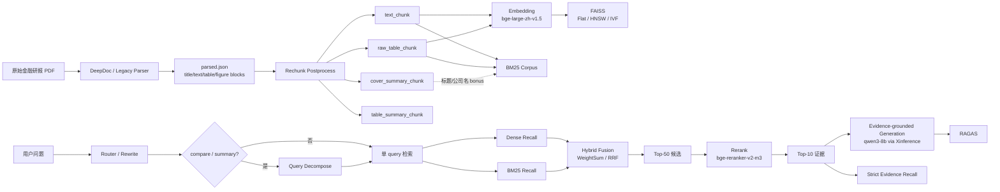

# 金融研报 RAG 项目文档整理

## 1. 项目概述

本项目面向中文金融研报问答，目标不是做一个“能问答”的演示系统，而是把金融 RAG 中最关键的几个环节做成一条可复现、可评测、可持续优化的工程链路。

项目当前覆盖：

- 数据规模：300 篇中文金融研报
- 领域覆盖：IT 服务、电力、半导体
- 评测集：125 条人工标注 query
- 任务类型：`fact` / `compare` / `summary`

整个系统围绕以下主线展开：

`PDF 解析 -> 结构化切块 -> 向量 / BM25 / 混合召回 -> 二阶段重排 -> Query Rewrite / Query Decompose -> 生成回答 -> 严格检索评测 + RAGAS 评测`

这个项目的难点，不在“大模型会不会说”，而在金融研报天然具备下面这些特征：

- 表格密集，关键信息经常不在自然段而在财务预测表、估值表、风险表中
- 公司名、时间、指标名、评级词对召回非常敏感
- 研报模板化严重，不同公司报告会反复出现“盈利预测”“风险提示”“买入评级”等相似片段
- compare / summary 不是单证据问题，必须命中多份证据才能算真的可回答

因此，本项目最终不是单点优化某个模型，而是持续围绕以下问题做工程迭代：

1. 如何让 PDF 解析后的知识单元足够稳定
2. 如何让表格和正文都能被检索到
3. 如何让公司名和指标名不被语义相似内容冲掉
4. 如何让多实体 compare / summary 问题真正覆盖完整证据
5. 如何让评测结果尽可能真实反映系统能力，而不是被标注过窄误伤

---

## 2. 系统架构

---

## 3. 模块设计与选型理由

## 3.1 PDF 解析：DeepDoc 为主，Legacy 为兜底

### 选型

- 主解析：DeepDoc
- 兜底解析：`legacy_parser.py`（PyMuPDF + pdfplumber）

### 选型理由

金融研报不是普通文本。真正关键的信息可能在：

- 风险提示段
- 评级和投资建议段
- 财务预测表
- 估值表
- 经营摘要

如果直接抽纯文本，表格会被打散，图表标题、页眉页脚、分析师信息会混进正文，后续 chunk 和检索都会受到污染。DeepDoc 的价值就在于先把 PDF 变成结构化 block：

- `title`
- `text`
- `table`
- `figure`

再交给后处理切块。

Legacy parser 保留下来，是为了避免整套系统完全绑定到单一视觉解析器。在环境不全或需要做快速回归对比时，仍然有启发式方案可用。

### 当前解析输出

- `*.parsed.json`
- `*.review.md`
- `*.review.html`

并保留：

- `page`
- `bbox`
- `block_id`
- `section / subsection`

这为后续 block-level 评测和引用溯源提供了基础。

---

## 3.2 结构化切块：不是“固定长度切文本”，而是“先理解结构再切”

### 切块脚本

`RAG/preprocess/rechunk_parsed_pdf.py`

### 输出的 chunk 类型

- `cover_summary_chunk`
- `text_chunk`
- `raw_table_chunk`
- `table_summary_chunk`
- `figure_summary_chunk`

### 当前默认纳入索引的 chunk

最终版本中，只对以下两类做 embedding 和索引：

- `text_chunk`
- `raw_table_chunk`

### 选型理由

项目一开始并不是直接走这条路线，而是经过了表格召回问题的迭代后才收敛到这个方案。

原因很明确：

1. `text_chunk` 是正文语义召回主力。
2. `raw_table_chunk` 保留完整表格内容，适合回答财务指标、预测值、估值表这类精确问题。
3. `table_summary_chunk` 虽然便于语义召回，但它是压缩后的抽象文本，容易丢掉原始表格中非表头的关键数值或文字说明。
4. `cover_summary_chunk` 能提供标题、公司名、评级等元信息，但如果直接参与检索，容易把“封面摘要”顶到前排，干扰真正证据块排序。

所以最终版本做了一个关键取舍：

> 用 `cover_summary_chunk` 抽标题/公司元数据，但不让它直接参与索引；  
> 用 `raw_table_chunk` 参与检索，而不是只保留 `table_summary_chunk`。

这一步是后续召回大幅提升的基础。

---

## 3.3 向量索引：bge-large-zh-v1.5 + FAISS

### 选型

- Embedding 模型：`BAAI/bge-large-zh-v1.5`
- 索引库：FAISS
- 对比结构：`Flat` / `HNSW` / `IVF`

### 选型理由

1. `bge-large-zh-v1.5` 是比较稳的中文检索基线，适合中文金融研报这类术语密集场景。
2. FAISS 工程成熟，适合快速做结构对比实验。
3. 项目先用 `Flat` 做准确率基准，再比较 `HNSW` 和 `IVF` 的速度/精度折中。

### 最终结论

- Dense-only 基线上，`Flat` 最强
- 但在引入 Hybrid + Rerank + Query Decompose 之后，`HNSW` 的最终效果已经接近 `Flat`

这意味着最终在线部署时，不必强绑定 `Flat`，可以在速度和精度之间做更灵活的权衡。

---

## 3.4 一阶段召回：Dense、BM25、Hybrid 三路并行对比

### 召回实现

`RAG/retrieval/three_way_retriever.py`

支持：

- `vector`
- `bm25`
- `hybrid_weightsum`
- `hybrid_rrf`

### 选型理由

#### Dense 的作用

- 解决语义相似召回
- 对“看好理由”“投资逻辑”“景气度提升原因”这类自然语言问题更友好

#### BM25 的作用

- 解决公司名、年份、季度、财务指标、评级词等关键词匹配
- 对金融问题特别重要，因为很多 query 的主约束不在语义，而在实体和数值词

#### 为什么必须做 Hybrid

金融研报检索里，Dense 和 BM25 各有明显短板：

- Dense-only：容易召回语义相近但公司错、年份错、指标错的段落
- BM25-only：能守住实体词，但跨表达泛化弱

因此最终系统不是“Dense 为主，BM25 补充”，而是二者必须协同。

### 当前默认融合方式

- `hybrid_weightsum`
- 权重：`vector / bm25 = 0.3 / 0.7`

### 为什么 BM25 权重更高

因为金融场景下：

- 公司名
- 年份
- 季度
- 指标名
- 评级词

这些词本身就具有很强的判别性。实验也验证了，BM25 权重偏高时整体效果更好。

### 标题 / 公司名增强

在最终检索版本中，项目没有把标题直接复制进所有 BM25 正文，而是做了更合理的分工：

- 向量侧：embedding 文本中显式拼入 `标题 + 公司`
- BM25 侧：正文仍只用 chunk 本体，但额外构建 `文档标题 + 公司名` 的 doc-level bonus

这样既保住了标题语义，又避免把标题词复制到每个 chunk 后稀释 BM25 的 IDF。

---

## 3.5 二阶段重排：让相关候选真正排上来

### 选型

- Reranker：`BAAI/bge-reranker-v2-m3`
- 典型流程：一阶段 Top-50，重排后取 Top-10

### 选型理由

一阶段检索解决的是“能不能把候选拉回来”；二阶段重排解决的是“这些候选里，真正能回答问题的证据排得靠不靠前”。

在金融研报场景里，排序错误非常常见：

- 同行业但错公司
- 同公司但错指标
- 同主题但错时间
- 相关解释段排在真正财务表前面

因此 reranker 是把系统从“粗召回可用”推进到“事实型问答稳定”的关键模块。

---

## 3.6 Query Rewrite / Query Decompose：解决追问与多实体问题

### Rewrite 的作用

`answer_query.py` 中先做 router，再做 rewrite：

- 通用概念问题可直接回答
- 涉及本地研报信息的问题强制走检索
- 对“那它呢”“这家公司风险呢”这类依赖上下文的问题做补全

### Query Decompose 的作用

它专门服务于：

- `compare`
- `summary`

因为这两类问题不是单证据失败，而是单 query 下难以同时覆盖多个实体证据。

---

## 3.7 生成与拒答：不是自由生成，而是证据绑定生成

### 选型

- 生成服务：Xinference
- 生成模型：`qwen3-8b`
- 输出格式：JSON

### 生成约束

输出中包含：

- `answer`
- `claims`
- `citations`
- `used_evidence`
- `confidence`
- `should_refuse`

### 设计理由

在金融场景中，比“回答自然”更重要的是：

- 不编数字
- 不编结论
- 没证据就拒答

因此系统把“证据绑定 + 低置信度拒答”作为缓解幻觉的主策略。

---

## 3.8 评测体系：Strict Evidence Recall + RAGAS

### 主评测：Strict Evidence Recall

项目最终采用 block-level 的严格检索评测：

- `fact`：命中 1 个核心证据
- `compare`：同时命中 2 个核心证据
- `summary`：同时命中 3 个核心证据

最初是单一 `gold evidence` 版本，后续进一步补充了等价证据组，见后文实验过程。

### 辅助评测：RAGAS

引入：

- `faithfulness`
- `answer_relevancy`
- `context_precision`
- `context_recall`

原因是 strict recall 只能评估“检索有没有找对块”，但对生成是否忠实、上下文是否有噪声，还需要额外指标补充。

---

## 4. 项目实验过程与问题演进

这一部分按真实研发顺序整理。重点不是罗列最终指标，而是把“遇到什么问题、尝试了什么方法、为什么这样改、最后解决到了什么程度”讲清楚。

---

## 4.1 第一阶段：先把 PDF 解析和切块做稳

### 遇到的问题

最开始最大的风险，不是检索，而是知识库构建本身：

- 页眉页脚、分析师信息、免责声明污染正文
- 封面摘要与正文混在一起
- 表格被切碎
- figure OCR 噪声混入 chunk

### 尝试的方法

在 `rechunk_parsed_pdf.py` 里做了结构化后处理：

1. block 级清洗
2. 封面单独生成 `cover_summary_chunk`
3. 正文按 section/subsection 切块
4. table 原子保护
5. 风险提示段明确保留
6. 低质量 figure 和声明性内容过滤

### 结果

这一阶段解决的是“可用语料质量”问题，为后续召回实验打下了基础。

---

## 4.2 第二阶段：先做 chunk 粒度实验，确定 512/50 是最稳的工程默认值

### 实验目的

找出最适合金融研报检索的 chunk 粒度。

### 固定条件

- Dense-only
- FAISS Flat
- 同一评测集

### 结果

来源：`RAG/output/eval_output/eval_chunk_recall.md`

| chunk_size | overlap | Recall@3 | Recall@5 | Recall@10 |
| ---: | ---: | ---: | ---: | ---: |
| 256 | 50 | 0.2160 | 0.2720 | 0.3200 |
| 256 | 100 | 0.2240 | 0.2800 | 0.3120 |
| 256 | 200 | 0.1840 | 0.2560 | 0.2960 |
| 512 | 50 | 0.2320 | 0.2720 | 0.3040 |
| 512 | 100 | 0.2320 | 0.2640 | 0.3040 |
| 512 | 200 | 0.2240 | 0.2560 | 0.3120 |
| 1024 | 50 | 0.1920 | 0.2560 | 0.2880 |
| 1024 | 100 | 0.1920 | 0.2560 | 0.2880 |
| 1024 | 200 | 0.2000 | 0.2560 | 0.2960 |

### 发现的问题

虽然 `256/50` 在 Dense-only 的 `Recall@10` 上略高，但出现了两个明显问题：

1. chunk 太碎，数量大，噪声高
2. compare / summary 全为 0，说明单靠切块参数并不能解决多证据问题

### 后续决定

进入 Hybrid 召回实验后，`512` 档整体更稳，最终在效果和工程成本之间，选择 `512/50` 作为后续默认分块配置。

---

## 4.3 第三阶段：Dense 不够，必须验证 BM25 和 Hybrid

### 实验目的

比较：

- Dense
- BM25
- Hybrid WeightSum
- Hybrid RRF

### 结果

来源：`RAG/output/eval_output/eval_retrieval_methods.md`

| retrieval | Recall@3 | Recall@5 | Recall@10 |
| --- | ---: | ---: | ---: |
| dense | 0.2320 | 0.2720 | 0.3040 |
| bm25 | 0.2640 | 0.3120 | 0.4080 |
| hybrid_weightsum | 0.2720 | 0.3280 | 0.4240 |
| hybrid_rrf | 0.2640 | 0.3280 | 0.4000 |

### 发现的问题

这一步给了项目非常关键的判断：

1. BM25 单路已经明显强于 Dense 单路
2. 说明金融场景中，关键词和实体词的重要性高于通用开放域任务
3. Hybrid 明显优于单路方案，后续应以 Hybrid 为主线

### 后续决定

保留两种 Hybrid 路线继续往后做：

- `hybrid_weightsum`
- `hybrid_rrf`

并继续做参数搜索。

---

## 4.4 第四阶段：调 Hybrid 参数，确认金融场景需要更强的 BM25 约束

### 实验目的

验证不同融合参数对效果的影响。

### 关键结果

来源：`RAG/output/eval_output/eval_hybrid_param_sweep.md`

| retrieval | Recall@10 |
| --- | ---: |
| hybrid_weightsum(0.2/0.8) | 0.4080 |
| hybrid_weightsum(0.3/0.7) | 0.4240 |
| hybrid_weightsum(0.4/0.6) | 0.4160 |
| hybrid_weightsum(0.5/0.5) | 0.3680 |

### 发现的问题

如果 Dense 权重过高，系统会召回更多“语义相似但实体不对”的内容。

### 后续决定

最终保留：

- `hybrid_weightsum(0.3 / 0.7)`

这表明在金融研报任务里，BM25 不是辅助信号，而是主信号之一。

---

## 4.5 第五阶段：对比 FAISS 索引结构，建立准确率与效率基线

### 实验目的

比较 `Flat / HNSW / IVF` 的速度和准确率。

### 结果

来源：`RAG/output/eval_output/eval_faiss_index_comparison.md`

| index | Recall@10 | 延迟(ms) |
| --- | ---: | ---: |
| Flat | 0.3040 | 0.895 |
| HNSW | 0.2880 | 0.083 |
| IVF | 0.2800 | 0.172 |

### 发现的问题

- `Flat` 是 Dense 基线准确率最高的索引
- 但 `HNSW` 的查询速度显著更快

### 后续决定

短期内仍以 `Flat` 作为准确率主实验；中后期则继续验证在更完整的召回链路下，`HNSW` 是否仍能维持接近效果。

---

## 4.6 第六阶段：加入二阶段 Rerank，但发现“严格评测假阴性”开始明显暴露

### 实验目的

在一阶段 Hybrid 基础上加二阶段 reranker，看排序是否能改善结果。

### 初版结果

在旧版评测集上，reranker 后：

- `hybrid_weightsum Recall@10 = 0.456`
- `hybrid_rrf Recall@10 = 0.440`

### 发现的问题

虽然事实题提升明显，但人工看输出时出现了一个很重要的问题：

> Top10 里明明已经召回了“能回答问题的等价证据”，但因为它不是最初人工标的那一个 `block_id`，strict recall 仍然判成 0。

这类问题在：

- 风险提示
- 投资建议
- 模板化财务表
- 多篇研报重复提到同一事实

中尤其常见。

### 核心判断

此时继续只调模型已经意义不大，因为评测本身开始低估系统能力。

### 采取的办法：重建 golden sample，补充等价证据组

这一步是项目过程中的关键转折点。

原始评测逻辑更接近：

- 一个 query 对应一组固定 `doc_id + block_id`

优化后，补充了等价证据集合，重建为：

- 组内 OR
- 组间 AND

具体规则：

- `fact`：命中任意一组等价证据即可
- `compare`：必须同时命中两个组件组
- `summary`：必须同时命中三个组件组

这套评测集最终落成：

- 新版：`recall_eval_m.json`
- 旧版保留：`recall_eval_mO.json`

### 补充等价证据后的结果

来源：`RAG/output/rerank_1/eval_rerank_summary__20260529_222016.md`

| route | Recall@10 | MRR@10 | NDCG@10 |
| --- | ---: | ---: | ---: |
| hybrid_weightsum | 0.5520 | 0.4086 | 0.5206 |
| hybrid_rrf | 0.5280 | 0.4049 | 0.5088 |

按类型：

| route | fact@10 | compare@10 | summary@10 |
| --- | ---: | ---: | ---: |
| hybrid_weightsum | 0.7529 | 0.2000 | 0.0500 |
| hybrid_rrf | 0.7176 | 0.2000 | 0.0500 |

### 这一阶段的结论

1. golden sample 重建不是“美化指标”，而是修正 strict recall 的假阴性问题
2. 经过这一步之后，系统真实瓶颈被看得更清楚了：
   - fact 已经不差
   - compare 和 summary 才是主要问题

---

## 4.7 第七阶段：针对 badcase 做检索结构改造，而不是继续盲调 reranker

这一阶段不是再去微调 reranker，而是回到 badcase 本身，分析检索失败的根因。

### 识别出的主要问题

根据项目记录，badcase 的主因不是“完全召不回”，而是：

1. 公司名约束不够强
2. 表格原文没被真正索引，表中非表头文字无法命中
3. `cover_summary_chunk` / `table_summary_chunk` 容易干扰前排排序
4. Reranker 更擅长语义相关，不擅长保证“完整证据组覆盖”

### 围绕这些问题做的改动

#### 改动 1：只保留 `text_chunk` 和 `raw_table_chunk` 参与索引

目的：

- 减少 `cover_summary_chunk`
- 减少 `table_summary_chunk`

对前排结果的污染

#### 改动 2：显式强化标题和公司名

最终 embedding 模板变为：

- `text_chunk = 标题 + 公司 + 正文`
- `raw_table_chunk = 标题 + 公司 + 前后文 + 表名 + 原始表格`

#### 改动 3：raw_table 直接进入索引

这一步很关键。项目早期其实更偏向：

- `table_summary_chunk` 用于召回
- `raw_table_chunk` 用于回答

但实际 badcase 证明，这样会漏掉很多表格内部的关键文字和数值，因此最终改为：

> raw_table 直接参与 embedding 和检索

#### 改动 4：BM25 只保留正文主体，同时增加 doc-level 标题/公司 bonus

避免标题文本污染 chunk 本体的 BM25 统计。

### 改造后的结果

来源：`RAG/output/rerank_3/eval_rerank_summary__qd_off__20260601_205301.md`

| route | Recall@10 | MRR@10 | NDCG@10 |
| --- | ---: | ---: | ---: |
| hybrid_weightsum | 0.8160 | 0.6211 | 0.8110 |
| hybrid_rrf | 0.8240 | 0.6225 | 0.8143 |

按类型：

| route | fact@10 | compare@10 | summary@10 |
| --- | ---: | ---: | ---: |
| hybrid_weightsum | 1.0000 | 0.7000 | 0.1500 |
| hybrid_rrf | 1.0000 | 0.7000 | 0.2000 |

### 这一阶段的结论

这是一个结构性提升，而不是小调参。

说明前面的判断是正确的：  
项目当时的主要问题不在 reranker，而在：

- 公司名语义缺失
- 标题信息缺失
- raw table 未参与索引
- summary 类 chunk 干扰排序

这一轮做完以后：

- fact 基本解决
- compare 已显著改善
- summary 仍然明显落后

因此系统下一阶段的主任务非常明确：解决多实体 / 多证据覆盖。

---

## 4.8 第八阶段：引入 Query Decompose，解决 compare / summary 的“单 query 覆盖不足”

这是项目后期最关键的一次能力提升。

### 为什么要做 Query Decompose

在前一阶段之后，事实题已经几乎解决，但 compare / summary 仍然存在一个共同瓶颈：

> 系统不是完全召不到相关内容，而是单个 query 下，多个实体之间会互相竞争，最终很难在 top-k 内完整覆盖多个证据组。

这不是 rerank 能单独解决的问题。

---

## 4.8.1 初版 Query Decompose：先做“实体拆分”

### 触发规则

纯规则识别：

- `compare`
  - 抽到 2 个公司名
  - 且命中“谁更高 / 谁更好 / 哪个更强”等比较词
- `summary`
  - 抽到 3 个公司名
  - 且命中“归纳总结 / 总结一下 / 归纳”等总结词

### 初版思路

把原问题拆成按实体展开的子 query：

- compare：拆 2 个
- summary：拆 3 个

每个子 query 独立做：

- hybrid retrieval
- rerank

然后再合并为最终 Top10。

### 它解决了什么问题

主要解决 compare 题里“第一个公司强势占位、第二个公司缺失”的问题，也初步改善了一部分 summary 问题。

### 初版结果

来源：`RAG/output/rerank_4/eval_rerank_summary__qd_on__20260601_204952.md`

| route | Recall@10 |
| --- | ---: |
| hybrid_weightsum | 0.8800 |
| hybrid_rrf | 0.8640 |

按类型：

| route | fact@10 | compare@10 | summary@10 |
| --- | ---: | ---: | ---: |
| hybrid_weightsum | 1.0000 | 0.9500 | 0.3000 |
| hybrid_rrf | 1.0000 | 0.9000 | 0.2500 |

### 初版结论

1. compare 提升非常明显：
   - `0.7000 -> 0.9500`
2. summary 也有提升，但仍不足：
   - `0.1500 -> 0.3000`

这说明“实体拆分”本身是对的，但 summary 还存在更深层次的问题。

---

## 4.8.2 为什么还要做 Query Decompose 优化版

初版 Decompose 之后，summary 仍然不理想。结合项目记录和输出分析，主要暴露了三个问题：

1. summary 子问题虽然拆开了，但合并时容易被某一个实体或某一篇文档的结果霸榜
2. 多个分支的候选没有做足够均衡的曝光，前排会扎堆
3. 部分 summary 问题不是简单的“拆实体”就够，还需要保留更完整的 aspect，比如：
   - 风险提示
   - 投资建议及看好理由
   - 2026-2028 年盈利预测与评级

也就是说，初版主要解决的是“拆不拆”的问题；优化版解决的是“拆完之后怎么合并、怎么均衡覆盖”的问题。

---

## 4.8.3 优化版 Query Decompose：按题型分桶召回、分桶 rerank、均衡合并

### 优化点 1：按 compare / summary 区分合并策略

在最终实现中：

- compare：更强调两个实体都要进榜
- summary：更强调三个实体都能获得前排曝光

### 优化点 2：分支 quota

最终实现中为不同题型设置了不同的 branch candidate/output 配额，例如：

- compare：每个分支保留更多候选
- summary：每个分支先保留固定数量，再做汇总

### 优化点 3：分支内先 rerank，再合并

不是先把所有分支混在一起再排，而是：

1. 每个实体子 query 先独立做 retrieval
2. 每个分支先 rerank
3. 再做全局合并

### 优化点 4：限制单文档过度占位

引入了类似 `max_hits_per_doc` 的控制思路，减少单文档/单实体在结果列表中重复占位的问题。

### 优化点 5：summary 合并时强调覆盖度，而不是只看全局分数

这一步本质上是在处理 summary 的真实痛点：

> 不是没有相关结果，而是多个分支的前排结果没有均衡展开，导致完整证据组很难同时进入 top10。

### 优化版结果

来源：`RAG/output/decompose_1/eval_rerank_summary__qd_on__20260601_233756.md`

| route | Recall@3 | Recall@5 | Recall@10 | MRR@10 | NDCG@10 |
| --- | ---: | ---: | ---: | ---: | ---: |
| hybrid_weightsum | 0.7440 | 0.9040 | 0.9440 | 0.6585 | 0.8641 |
| hybrid_rrf | 0.7200 | 0.8720 | 0.9280 | 0.6507 | 0.8539 |

按类型：

| route | fact@10 | compare@10 | summary@10 |
| --- | ---: | ---: | ---: |
| hybrid_weightsum | 1.0000 | 0.9500 | 0.7000 |
| hybrid_rrf | 1.0000 | 0.9500 | 0.6000 |

### 优化版结论

1. compare 基本被做稳
2. summary 从 `0.3000` 提升到 `0.7000`
3. Query Decompose 的主要收益不是“更多 query”，而是：
   - 多实体拆分
   - 分支内独立排序
   - 分支间均衡合并

这是项目中最值得强调的一个设计亮点。

---

## 4.9 第九阶段：验证 HNSW 在完整链路下是否还能保持效果

在 `Flat` 上把完整链路跑通后，项目又验证了 `HNSW + Query Decompose + Rerank`。

来源：`RAG/output/decompose_2/eval_rerank_summary__qd_on__20260602_152109.md`

| route | Recall@10 | MRR@10 | NDCG@10 |
| --- | ---: | ---: | ---: |
| hybrid_weightsum | 0.9440 | 0.6578 | 0.8672 |
| hybrid_rrf | 0.9280 | 0.6500 | 0.8572 |

### 结论

`HNSW` 在完整优化链路下，最终指标已经非常接近 `Flat`。

这说明：

- 前期 Dense-only 的索引损失，不代表最终系统损失
- 当上层检索策略足够成熟时，近似索引完全可以进入候选方案

---

## 4.10 第十阶段：接入生成与 RAGAS，确认系统主瓶颈已从“召回不到”转向“多证据组织”

### RAGAS 结果

来源：`RAG/output/ragas_eval/ragas_eval__20260606_032006.json`

| 类型 | faithfulness | answer_relevancy | context_precision | context_recall |
| --- | ---: | ---: | ---: | ---: |
| fact | 0.907 | 0.923 | 0.904 | 1.000 |
| compare | 0.580 | 0.828 | 0.000 | 0.767 |
| summary | 0.267 | 0.751 | 0.007 | 0.450 |
| overall | 0.827 | 0.880 | 0.614 | 0.874 |

### 发现的问题

即便检索指标已经很强，compare / summary 的生成质量仍然明显弱于 fact。

这说明系统当前剩余的主要瓶颈已经不是：

- 找不到证据

而是：

- 多证据如何组织成答案
- 上下文排序如何更适合生成
- 单位换算、比较结论、风险归纳如何显式表达

### 项目中的进一步判断

根据项目记录，后续可以继续沿三个方向优化：

1. compare / summary 结果按子 query 交替排布，提升前排覆盖度
2. 对单位换算、比较结论加入更强的生成约束
3. 继续提升 evidence planning，让模型先按实体/指标/年份列提纲再生成

---

## 5. 核心实验结果汇总

## 5.1 切块统计

来源：`RAG/docs/chunk_strategy_comparison.md`

| chunk_size | overlap | total_chunks | avg_tokens/chunk |
| ---: | ---: | ---: | ---: |
| 256 | 50 | 12142 | 282.94 |
| 256 | 100 | 12419 | 285.25 |
| 256 | 200 | 12943 | 308.20 |
| 512 | 50 | 8406 | 382.97 |
| 512 | 100 | 8477 | 383.59 |
| 512 | 200 | 8760 | 392.27 |
| 1024 | 50 | 6769 | 462.07 |
| 1024 | 100 | 6777 | 462.51 |
| 1024 | 200 | 6804 | 466.56 |

---

## 5.2 一阶段召回最佳结果

来源：`RAG/output/eval_output/eval_retrieval_methods.md`

| route | Recall@3 | Recall@5 | Recall@10 |
| --- | ---: | ---: | ---: |
| dense | 0.2320 | 0.2720 | 0.3040 |
| bm25 | 0.2640 | 0.3120 | 0.4080 |
| hybrid_weightsum | 0.2720 | 0.3280 | 0.4240 |
| hybrid_rrf | 0.2640 | 0.3280 | 0.4000 |

---

## 5.3 补充等价证据后的二阶段结果

来源：`RAG/output/rerank_1/eval_rerank_summary__20260529_222016.md`

| route | Recall@10 | MRR@10 | NDCG@10 |
| --- | ---: | ---: | ---: |
| hybrid_weightsum | 0.5520 | 0.4086 | 0.5206 |
| hybrid_rrf | 0.5280 | 0.4049 | 0.5088 |

---

## 5.4 检索结构改造后的结果

来源：`RAG/output/rerank_3/eval_rerank_summary__qd_off__20260601_205301.md`

| route | Recall@10 | fact@10 | compare@10 | summary@10 |
| --- | ---: | ---: | ---: | ---: |
| hybrid_weightsum | 0.8160 | 1.0000 | 0.7000 | 0.1500 |
| hybrid_rrf | 0.8240 | 1.0000 | 0.7000 | 0.2000 |

---

## 5.5 Query Decompose 初版结果

来源：`RAG/output/rerank_4/eval_rerank_summary__qd_on__20260601_204952.md`

| route | Recall@10 | fact@10 | compare@10 | summary@10 |
| --- | ---: | ---: | ---: | ---: |
| hybrid_weightsum | 0.8800 | 1.0000 | 0.9500 | 0.3000 |
| hybrid_rrf | 0.8640 | 1.0000 | 0.9000 | 0.2500 |

---

## 5.6 Query Decompose 优化版结果

来源：`RAG/output/decompose_1/eval_rerank_summary__qd_on__20260601_233756.md`

| route | Recall@10 | fact@10 | compare@10 | summary@10 |
| --- | ---: | ---: | ---: | ---: |
| hybrid_weightsum | 0.9440 | 1.0000 | 0.9500 | 0.7000 |
| hybrid_rrf | 0.9280 | 1.0000 | 0.9500 | 0.6000 |

---

## 5.7 HNSW 完整链路结果

来源：`RAG/output/decompose_2/eval_rerank_summary__qd_on__20260602_152109.md`

| route | Recall@10 | MRR@10 | NDCG@10 |
| --- | ---: | ---: | ---: |
| hybrid_weightsum | 0.9440 | 0.6578 | 0.8672 |
| hybrid_rrf | 0.9280 | 0.6500 | 0.8572 |

---

## 5.8 RAGAS 结果

来源：`RAG/output/ragas_eval/ragas_eval__20260606_032006.json`

| overall | score |
| --- | ---: |
| faithfulness | 0.8268 |
| answer_relevancy | 0.8802 |
| context_precision | 0.6139 |
| context_recall | 0.8737 |

---

## 6. 当前最佳方案

从项目全流程实验看，当前最推荐的配置是：

- 解析：DeepDoc + `rechunk_parsed_pdf.py`
- 分块：`512 / 50`
- 索引对象：`text_chunk + raw_table_chunk`
- embedding：`bge-large-zh-v1.5`
- embedding 文本：
  - `text = 标题 + 公司 + chunk 正文`
  - `raw_table = 标题 + 公司 + 前后文 + 表名 + 原表格`
- 一阶段召回：`hybrid_weightsum`
- 融合权重：`0.3 / 0.7`
- BM25：正文主体 + 文档标题/公司 bonus
- 二阶段重排：`bge-reranker-v2-m3`
- compare / summary：开启优化版 Query Decompose
- 评测集：使用补充等价证据后的 `recall_eval_m.json`

对应核心结果：

| 指标 | 分数 |
| --- | ---: |
| Recall@3 | 0.7440 |
| Recall@5 | 0.9040 |
| Recall@10 | 0.9440 |
| MRR@10 | 0.6585 |
| NDCG@10 | 0.8641 |

按类型：

| 类型 | Recall@10 |
| --- | ---: |
| fact | 1.0000 |
| compare | 0.9500 |
| summary | 0.7000 |

---

## 7. 项目中的关键问题与最终解决方式

最后把整个项目最重要的“问题 -> 方法 -> 结果”压缩总结如下：

### 问题 1：PDF 结构复杂，表格和正文混杂

解决：

- DeepDoc 结构化解析
- block 级清洗
- 表格原子保护

结果：

- 知识库质量稳定，后续检索实验可复现

### 问题 2：Dense-only 无法应对金融实体词约束

解决：

- 引入 BM25
- 做 Hybrid 融合

结果：

- 一阶段 Recall@10 从 `0.3040` 提升到 `0.4240`

### 问题 3：严格评测存在等价证据假阴性

解决：

- 重建 golden sample
- 补充等价证据组
- 从单点 `gold block` 改成“组内 OR、组间 AND”

结果：

- 二阶段检索结果被更真实地反映出来

### 问题 4：表格和公司名信号不足，导致 fact 和 compare 被误召回

解决：

- 只保留 `text_chunk + raw_table_chunk`
- embedding 中显式加入标题和公司名
- raw_table 拼接前后文和表名
- BM25 加 doc-level 标题/公司 bonus

结果：

- 整体 Recall@10 从 `0.5520` 提升到 `0.8240`
- fact@10 提升到 `1.0000`

### 问题 5：compare / summary 单 query 下难以完整覆盖多个实体证据

解决：

- 引入 Query Decompose
- 初版先做实体拆分
- 优化版再做分支内 rerank、分支 quota、均衡合并、单文档去重控制

结果：

- compare@10：`0.7000 -> 0.9500`
- summary@10：`0.1500 -> 0.7000`

### 问题 6：检索效果已经很强，但生成端仍难组织多证据答案

解决：

- 加证据绑定生成
- 加拒答机制
- 使用 RAGAS 定位 compare / summary 的生成问题

结果：

- fact 生成较稳定
- compare / summary 的主要瓶颈被明确定位到“多证据组织与上下文排序”

---

## 8. 下一步可继续优化的方向

当前系统已经把主问题从“能不能检索到”推进到了“多证据怎么组织得更好”。如果继续迭代，最值得投入的方向有：

1. compare / summary 结果按子 query 交替排布，进一步提升 context precision
2. 生成前做单位标准化和显式比较推理
3. 在生成阶段加入 evidence planning，先按实体/指标/年份组织提纲
4. 继续补全 summary 类 query 的等价证据与弱结构字段映射

---

## 9. 一句话总结

这个项目最核心的价值，不是“用了哪些模型”，而是完整走通了一个金融研报 RAG 从工程构建到实验验证的演进过程：

> 先解决结构化解析和表格保护，再用 Hybrid 检索守住金融关键词与实体约束，用 reranker 提升排序质量，用等价证据重建评测集纠正 strict 假阴性，最后通过两阶段 Query Decompose 真正把 compare 和 summary 做起来。
